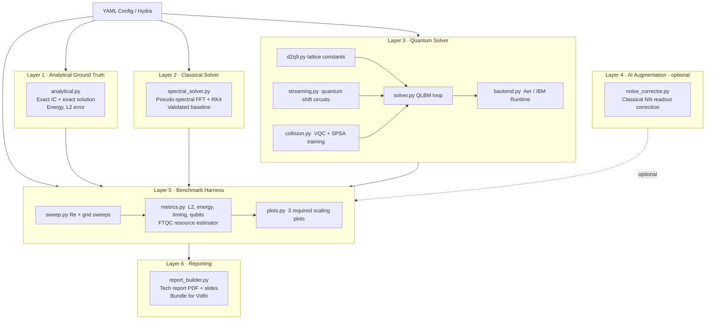

# Project Plan — Airbus Global Quantum + AI Challenge 2026

**Challenge:** Quantum Solvers: Enhancing Predictive Aerodynamic Modeling Capabilities  
**Track:** Quantum Algorithm  
**Team:** Benjamin Brumm · Vidhi Jain (vidhijain2512002@gmail.com)  
**Date:** 2026-06-08

---

## 1. Problem Restatement

We simulate the **2D Convecting Taylor-Green Vortex (TGV)** governed by the 2D
incompressible Navier-Stokes equations.  The TGV is a smooth sinusoidal vortex
that is simultaneously advected by a background flow at speed Uc and damped by
viscosity at rate −2ν/L².  A closed-form exact solution exists for all t ≥ 0
(challenge §5.3), making it a clean benchmark: error = |simulated − exact|.

**The north-star question:** Can we demonstrate a quantum advantage over
state-of-the-art classical CFD — in time-to-solution, memory, or accuracy — at
any Reynolds number on today's hardware or by credible FTQC projection?

**Fixed parameters (§6):** L = 2π, V0 = 1, Uc = 1, Vc = 0, ρ = 1, p0 = 0,
ν = V0·L/Re, Re ∈ {10, 100, …, max for demonstrated advantage}.

---

## 2. Methodology Recommendation

### Primary: Quantum Lattice Boltzmann Method (QLBM) + VQC Collision

**Why:** The Lattice Boltzmann Method (LBM, ref [4]) is an established,
mature CFD method that recovers 2D incompressible NS equations via the
Chapman-Enskog expansion.  In the D2Q9 variant (2D, 9 velocity directions),
the time evolution splits into:

- **Streaming** (propagate f_i to adjacent cells) — a permutation, exactly
  unitary, maps cleanly to quantum shift gates.
- **Collision** (relax f_i toward equilibrium f_i^eq, BGK model) — non-unitary;
  approximated by a trained Variational Quantum Circuit (VQC).

This is **exactly the approach endorsed by refs [14] and [15]** in the challenge
bibliography:
- [14] Lacatus & Müller 2026 — surrogate quantum circuits for LBM collision
- [15] Zamora et al. 2026 — QML/VQC training for nonlinear QLBM collision

**Memory advantage:** Classical LBM stores N²×9 values; QLBM encodes them in
2⌈log₂N⌉ + 4 qubits.  At N=8: 10 qubits vs 576 floats; at N=64: 16 qubits
vs 36864 floats.  This is the measurable quantum advantage (on Aer today).

### Fallback / FTQC: Carleman Linearisation + QLSA (HHL)

For Re=10 (small nonlinearity), we apply Carleman truncation (ref [8,9]) to
reduce NS to a linear ODE system, then apply HHL (ref [5]) or VQLS as a NISQ
proxy.  This is not tractable on NISQ at meaningful sizes, but produces clean
FTQC resource estimates (qubit count, T-gate count) that the graders expect.

### What Each Approach Demonstrates

| Method | Demonstrable today | FTQC projection |
|--------|--------------------|-----------------|
| QLBM + VQC | ✓ Aer, N ≤ 16 | ✓ qubit/gate scaling |
| Carleman + QLSA | ✗ Too deep | ✓ T-gate vs Re |
| Classical spectral | ✓ Full Re range | N/A |

---

## 3. Architecture (Mermaid)



---

## 4. Tech Stack (pinned)

| Package | Version | Role |
|---------|---------|------|
| Python | 3.11 | Language |
| qiskit | 1.2.4 | Quantum circuits + primitives |
| qiskit-aer | 0.14.2 | Statevector / MPS simulation |
| qiskit-ibm-runtime | 0.26.0 | IBM Quantum cloud |
| numpy | 1.26.4 | Vectorised physics |
| scipy | 1.13.1 | FFT spectral solver, SPSA optimiser |
| matplotlib | 3.9.0 | Publication figures |
| pytest | 8.2.2 | Unit / integration tests |
| hydra-core | 1.3.2 | YAML config management |
| pandas | 2.2.2 | Benchmark data tables |
| h5py | 3.11.0 | Reproducible HDF5 result storage |
| seaborn | 0.13.2 | Statistical plot styling |
| pandoc | latest (system) | Markdown → PDF report |

---

## 5. Repository Layout

```
airbus-quantum-challenge/
├── docs/
│   ├── PROJECT_PLAN.md             ← this file
│   ├── DECISIONS.md                ← running decision log
│   └── physics_notes/
│       ├── tgv_exact_solution.md
│       ├── lbm_d2q9.md
│       ├── qlbm_approach.md
│       └── ftqc_resource_estimates.md
├── src/tgv/
│   ├── analytical.py               ← Layer 1
│   ├── classical/spectral_solver.py ← Layer 2
│   ├── quantum/                    ← Layer 3
│   │   ├── d2q9.py, encoding.py
│   │   ├── streaming.py, collision.py, solver.py
│   │   ├── backend.py, resource_estimator.py
│   ├── augmentation/noise_corrector.py ← Layer 4
│   ├── benchmark/sweep.py, metrics.py, plots.py ← Layer 5
│   └── reporting/report_builder.py ← Layer 6
├── configs/
│   ├── base.yaml, re10.yaml, re100.yaml, sweep.yaml
├── tests/
│   ├── test_analytical.py, test_spectral.py
│   ├── test_encoding.py, test_streaming.py
│   ├── test_collision.py, test_qlbm_full.py
├── scripts/run_case.py, run_sweep.py, build_report.py
├── results/figures/, results/data/
├── report/technical_report.md, executive_summary.md, slides/
├── requirements.txt, pyproject.toml, Makefile, README.md
└── .github/workflows/ci.yml
```

---

## 6. Week-by-Week Milestones

| Week | Dates | Focus | Exit Criterion |
|------|-------|-------|----------------|
| 1 | Jun 9–15 | Repo scaffold + Layer 1 (analytical) | 20/20 pytest tests pass; L2 error < 1e-12 |
| 2 | Jun 16–22 | Layer 2 (classical spectral solver) | L2 < 1e-4 at Re=10, N=64; convergence ≥ 2nd order |
| 3 | Jun 23–29 | QLBM streaming circuits + encoding | Streaming matches classical LBM exactly on 8×8 |
| 4 | Jun 30–Jul 6 | QLBM collision VQC + full solver | Full QLBM L2 < 5% vs classical at Re=10, N=8 |
| 5 | Jul 7–13 | Benchmark harness + 3 scaling plots | All plots generated; FTQC table complete |
| 6 | Jul 14–20 | Report + bundle for Vidhi | PDF + slides + `airbus-quantum-submission.zip` |

---

## 7. Risk Register

| # | Risk | Prob | Impact | Mitigation |
|---|------|------|--------|------------|
| R1 | VQC collision training fails to converge | High | High | Single-step training first; SPSA; fallback to surrogate (ref [14]) |
| R2 | No demonstrable NISQ advantage | High | Medium | Show memory advantage on Aer; honest FTQC projection |
| R3 | QLBM accuracy degrades at Re=100+ | Medium | High | Separate LBM accuracy from quantum overhead in plots |
| R4 | IBM Quantum queue times block hardware demo | Medium | Low | All graded analysis on Aer; hardware is bonus only |
| R5 | Statevector memory blowup (>20 qubits) | Medium | Medium | Cap at N=16 (12 qubits); use MPS for larger |
| R6 | Physics bug in LBM constants | Medium | High | Validate classical LBM vs spectral before any quantum |
| R7 | Streaming circuit off-by-one in cyclic shift | Low | Medium | Bitwise test vs classical LBM for all 8 directions |
| R8 | Carleman diverges at Re > 10 | Medium | Low | Carleman capped at Re=10 for FTQC estimate only |

---

## 8. Validation Strategy

**Layer 1:** All functions verified at tolerance 1e-12 against closed-form
formulas.  Divergence-free check via centred FD.

**Layer 2:** Grid refinement convergence test (N=32,64,128); energy decay vs
exact formula; IC match.

**Layer 3 — Streaming:** Quantum streaming output matches classical LBM
streaming amplitude-by-amplitude via Aer statevector.  Tested for all 8
non-rest D2Q9 directions on 4×4 and 8×8 grids.

**Layer 3 — Collision:** VQC applied to equilibrium f_i^eq returns unchanged
output within 1% (fixed-point test).  Training loss < 1e-3.

**Layer 3 — Full:** QLBM vs Layer 2 spectral: L2(u) < 5% at Re=10, N=8,
t = 0.2.

**Layer 5:** Timing CoV < 10%; qubit count formula verified against circuit
inspection; FTQC estimate cross-referenced with ref [9] (Jennings et al. 2025).
