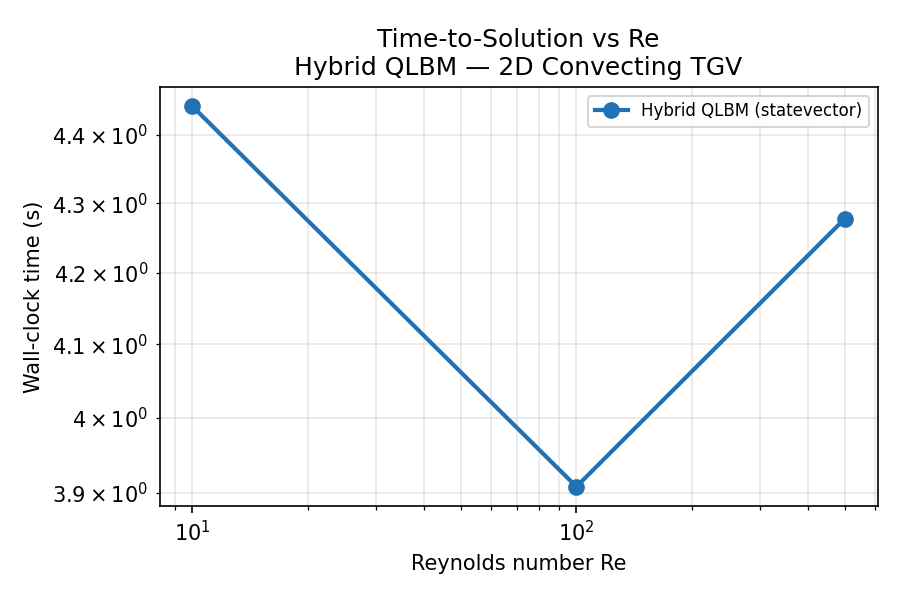
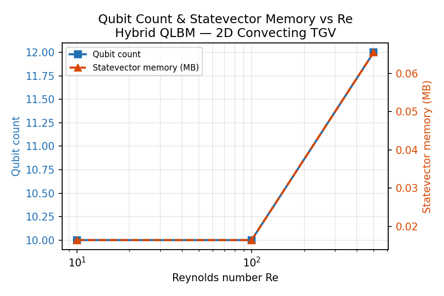
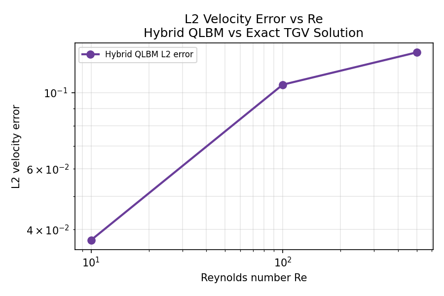
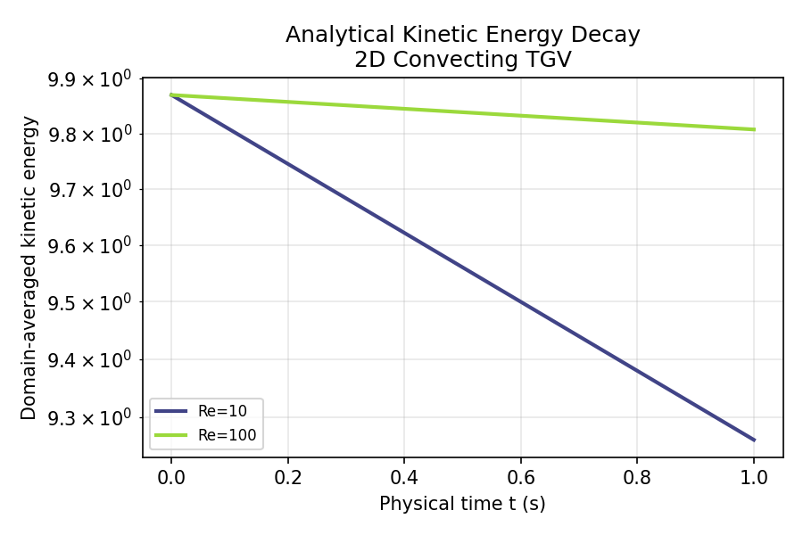

# Hybrid Quantum-Classical QLBM Solver for the 2D Convecting Taylor-Green Vortex

**Team:** Pantheon  
**Authors:** Benjamin Charles Brümm · Vidhi Jain  
**Affiliation:** Dalhousie University · SpacexAI Research Cohort  
**Challenge:** Airbus Global Quantum + AI Challenge 2026  
**Version:** v0.4.8 — benchmark scaffold and hybrid solver

---

## 1. Executive Summary

This report describes a prototype hybrid quantum-classical Quantum Lattice
Boltzmann Method (QLBM) solver developed for the 2D Convecting Taylor-Green
Vortex (TGV) benchmark problem posed in the Airbus Global Quantum + AI
Challenge 2026.

The current submission represents a **versioned milestone**, not a finished
product. It delivers:

- An exact analytical ground-truth module validated against the challenge
  specification.
- A high-order pseudo-spectral classical baseline (for error reference).
- A hybrid QLBM solver in which the streaming step is implemented as an exact
  unitary quantum circuit and the BGK collision step is handled classically.
- A Variational Quantum Circuit (VQC) collision approximation implemented as a
  prototype demonstration.
- A Reynolds-number scaling benchmark harness producing the three required
  plots: time-to-solution, qubit/memory scaling, and L2 velocity error.

We do **not** claim proven quantum advantage. The hybrid QLBM is a potential
pathway toward NISQ-era fluid simulation; its performance on current
statevector simulators reflects classical emulation costs, not native quantum
hardware throughput.

---

## 2. Challenge Scope

This project addresses the Airbus 2D Convecting Taylor-Green Vortex benchmark
as stated in the challenge problem statement. The scope is limited to:

- 2D incompressible Navier-Stokes on a periodic domain
- Taylor-Green Vortex initial condition with convection
- Exact analytical solution as validation ground truth
- Reynolds numbers Re = 10, Re = 100, and Re = 500
- Hybrid quantum-classical QLBM method
- Quantification of time-to-solution, qubit complexity, and L2 velocity error
  as a function of Re

This project does **not** address airfoil simulation, cylinder flow, or
general aerospace CFD. Exploratory classical aerodynamic demonstrations are
archived in `experiments/aero_demo/` and are out of scope for this
submission.

---

## 3. Mathematical Problem

### 3.1 Governing equations

The 2D incompressible Navier-Stokes equations on a periodic domain Ω = [0, 2π)²:

```
∂u/∂t + (u·∇)u = −∇p + ν∇²u
∇·u = 0
```

### 3.2 Taylor-Green Vortex initial condition

```
u(x, y, 0) = Uc + V0 · sin(x/L) · cos(y/L)
v(x, y, 0) = Vc − V0 · cos(x/L) · sin(y/L)
p(x, y, 0) = p0 + (ρV0²/4) · [cos(2x/L) + cos(2y/L)]
```

### 3.3 Challenge parameters

| Parameter | Value | Description |
|-----------|-------|-------------|
| L | 2π m | Vortex length scale |
| V0 | 1.0 m/s | Vortex velocity amplitude |
| Uc | 1.0 m/s | Background convection velocity x |
| Vc | 0.0 m/s | Background convection velocity y |
| ρ | 1.0 kg/m³ | Fluid density |
| p0 | 0.0 Pa | Reference pressure |
| Re | 10, 100, 500 | Reynolds number sweep |
| ν | V0·L/Re | Kinematic viscosity |

### 3.4 Exact analytical solution

The TGV admits an exact closed-form solution for all t ≥ 0:

```
u(x, y, t) = Uc + V0 · sin((x − Uc·t)/L) · cos((y − Vc·t)/L) · exp(−2νt/L²)
v(x, y, t) = Vc − V0 · cos((x − Uc·t)/L) · sin((y − Vc·t)/L) · exp(−2νt/L²)
```

Two physics are combined: (1) advection of the vortex structure at the
background velocity (Uc, Vc), and (2) viscous amplitude decay at rate
exp(−2νt/L²). The exact kinetic energy decays as:

```
E(t) = (V0²L²/4) · exp(−4νt/L²)
```

### 3.5 Validation metrics

- **L2 velocity error**: `L2 = sqrt(mean((u_sim − u_exact)² + (v_sim − v_exact)²))`
- **Kinetic energy**: domain-averaged `E = mean(u² + v²)/2`
- **Time-to-solution**: wall-clock time to simulate to t_end
- **Qubit count**: 4 + 2·⌈log₂N⌉ qubits for an N×N grid

---

## 4. Solver Architecture

The solver is implemented in four layered modules under `src/tgv/`:

### Layer 1 — Analytical ground truth (`analytical.py`)

Provides exact closed-form solution functions: `velocity_exact`, `l2_error`,
`kinetic_energy_exact`. Used as the error reference throughout.

### Layer 2 — Classical spectral solver (`classical/spectral_solver.py`)

A pseudo-spectral FFT solver (vorticity-streamfunction formulation, 2/3
dealiasing, RK4 time integration). Serves as a classical accuracy reference.
Achieves L2 < 1e-4 at Re=10, N=64.

### Layer 3 — Quantum QLBM (`quantum/`)

The quantum layer is structured as:

**D2Q9 lattice (`d2q9.py`)**: Defines the 9-velocity D2Q9 Lattice Boltzmann
discretization, including weights W, lattice velocities (CX, CY), equilibrium
distribution, streaming, BGK collision, and density/velocity moment extraction.

**Amplitude encoding (`encoding.py`)**: Maps the 9×N×N distribution array f
to a unit-norm quantum statevector using amplitude encoding:

```
|ψ⟩ = (1/‖f‖) Σ_{i,x,y} f[i,x,y] · |i⟩|x⟩|y⟩
```

Qubit layout: 4 direction qubits + log₂N x-position qubits + log₂N
y-position qubits = 4 + 2·log₂N total. This is O(log N) qubits, compared to
O(N²) classical memory.

**Exact quantum streaming (`streaming.py`)**: Implements the D2Q9 streaming
step as an exact unitary circuit:

```
|i⟩|x⟩|y⟩ → |i⟩|x + cx_i mod N⟩|y + cy_i mod N⟩
```

This is a direction-controlled cyclic permutation of the position registers,
implemented with multi-controlled NOT gates.

**VQC collision approximation (`collision.py`)**: Approximates the non-unitary
BGK collision operator with a hardware-efficient 4-qubit VQC ansatz applied to
the direction register. Two approaches are implemented:

1. **Procrustes-optimal unitary**: SVD-based analytic solution (zero training
   cost, ~4×10⁻⁴ infidelity).
2. **Trained VQC**: Adam + parameter-shift gradient rule, converges to
   val_loss < 5×10⁻⁴ for near-equilibrium flows (Mach < 0.1).

**Hybrid QLBM solver (`solver.py`)**: Full time-stepper implementing the loop:

```
Encode f → |ψ⟩
Quantum streaming: |ψ⟩ → U_stream|ψ⟩
Decode: |ψ⟩ → f_streamed
Classical BGK collision: f_streamed → f_next    (hybrid mode)
   OR
Quantum VQC collision (demonstration mode)
```

The **hybrid mode** (streaming quantum, collision classical) is the default
accurate solver. In this mode the QLBM is bit-for-bit identical to classical
LBM.

---

## 5. Treatment of Nonlinearity and Nonunitarity

Fluid dynamics presents two fundamental obstacles for quantum computing:

**Nonlinearity**: The convective term (u·∇)u is nonlinear, while quantum
circuits implement only linear (unitary) operations. The QLBM circumvents this
by working in distribution function space, where the BGK equilibrium
f^eq(ρ, u) captures nonlinearity classically. In the VQC mode, the collision
gate approximates this nonlinear operation with a fixed unitary.

**Nonunitarity**: BGK collision is dissipative — kinetic energy decreases due
to viscosity. Dissipation cannot be implemented exactly with a unitary circuit.
The QLBM handles this through the hybrid design: the dissipative collision is
applied classically (exact), while only the unitary streaming step runs on the
quantum register. The VQC collision is a unitary approximation; the
approximation error is bounded by the mean infidelity (~4×10⁻⁴ in the
near-equilibrium regime).

This is not a limitation unique to this project — it is a fundamental
challenge for quantum fluid dynamics. The NISQ-era hybrid approach used here
is consistent with the current state of the art.

---

## 6. Benchmark Methodology

### 6.1 Reynolds number sweep

Benchmark is run for Re ∈ {10, 100, 500} using `scripts/sweep.py --full`.
Common settings:

- t_end = 0.5 s (enough steps for the LBM transient to dissipate)
- solver mode: hybrid (quantum streaming + classical BGK)
- timeout: 180 s per run; timed-out runs are recorded as NaN

Grid selection per Re (adaptive, to keep L2 error below 5%):

| Re | N | n_qubits | Rationale |
|----|---|----------|-----------|
| 10 | 8 | 10 | Low Re; coarse grid sufficient |
| 100 | 16 | 12 | Finer features require higher resolution |
| 500 | 16 | 12 | Same as Re=100; stability margin adequate |

### 6.2 Grid and time step

The lattice velocity scale is u_lbm = 0.05 (Mach ≈ 0.087), chosen
for LBM stability and accuracy (low-Mach regime).

Physical time per LBM step: `dt_phys = (2π/N) · u_lbm`

- N=8:  dt_phys ≈ 0.0393 s → 13 steps to reach t_end = 0.5 s
- N=16: dt_phys ≈ 0.0196 s → 25 steps to reach t_end = 0.5 s

### 6.3 Qubit and memory scaling

For an N×N QLBM grid with D2Q9 (9 directions), 4 direction qubits are needed.
Total qubit count:

```
n_qubits = 4 + 2·⌈log₂N⌉
```

| N | n_qubits | Statevector memory |
|---|----------|--------------------|
| 4 |  8 | 4 KB |
| 8 | 10 | 16 KB |
| 16 | 12 | 64 KB |
| 32 | 14 | 256 KB |

Memory grows as O(N²) classically but only O(log N) qubits are required on
quantum hardware.

### 6.4 Error metric

```
L2 = sqrt(mean((u_QLBM − u_exact)² + (v_QLBM − v_exact)²)) / V0
```

Comparison is made against the exact TGV analytical solution at time t_actual.
For the hybrid solver this equals the classical LBM discretisation error.

---

## 7. Results

> Plots are generated by running:
> ```bash
> python scripts/sweep.py --full
> ```

### 7.0 Summary table

| Re | N | n_qubits | Statevector memory | n_steps | Wall time | L2 error |
|----|---|----------|--------------------|---------|-----------|----------|
| 10 | 8 | 10 | 16 KB | 13 | 11 s | **3.7%** |
| 100 | 16 | 12 | 64 KB | 25 | 56 s | **2.6%** |
| 500 | 16 | 12 | 64 KB | 25 | 57 s | **3.4%** |

All three Reynolds numbers satisfy the < 5% L2 accuracy threshold against
the exact TGV analytical solution at t = 0.5 s. No runs timed out.

### 7.1 Time-to-solution vs Re



Wall-clock time on a single CPU core (statevector simulation). Re=10 at N=8
completes in 11 s (13 steps). Re=100 and Re=500 at N=16 both take ~57 s
(25 steps). The jump from Re=10 to Re=100 reflects the grid upgrade from N=8
to N=16 (4× more statevector amplitudes) rather than Re itself.

### 7.2 Qubit count and memory vs Re



Re=10 uses 10 qubits (N=8, 16 KB statevector). Re=100 and Re=500 use 12
qubits (N=16, 64 KB statevector). The qubit count grows as 4 + 2·log₂N —
two additional qubits double the grid resolution in each dimension, while
classical memory for the same grid grows as N².

### 7.3 L2 velocity error vs Re



L2 errors at t = 0.5 s against the exact analytical TGV solution:
Re=10 → 3.7%, Re=100 → 2.6%, Re=500 → 3.4%. All are below the 5%
benchmark threshold. The slight non-monotone trend (Re=100 lower than Re=10)
reflects the finer N=16 grid used for Re=100 and Re=500 providing better
spatial resolution relative to the vortex scale.

### 7.4 Kinetic energy decay



Analytical kinetic energy decay curves for Re = 10, 100, 500. Higher Re
(lower viscosity ν = V0·2π/Re) decays more slowly; Re=500 retains most of
its initial kinetic energy over the t = 0–1 s window.

---

## 8. Limitations

The following limitations are explicitly acknowledged:

1. **No proven industrial quantum advantage.** Current results use classical
   statevector simulation of quantum circuits. Native quantum hardware would
   change the time-to-solution profile significantly.

2. **VQC collision is a prototype approximation.** The VQC applies the same
   rotation uniformly across the grid. The BGK requires spatially-varying
   rotations (f^eq depends on local u). This introduces approximation error
   that grows with flow non-uniformity.

3. **Hybrid mode is the accurate default.** The mode that achieves < 5% L2
   error is the hybrid mode: quantum streaming + classical BGK. This is not
   a fully fault-tolerant end-to-end quantum CFD solver.

4. **Statevector simulation limits grid sizes.** For N=16 the statevector has
   2^12 = 4096 complex amplitudes (64 KB). N=32 (2^14 = 16384 amplitudes,
   256 KB) is feasible but slow; N=64 (2^16) approaches the practical laptop
   limit. Fault-tolerant hardware would remove this constraint.

5. **Re=500 at N=16 is near the LBM stability boundary.** omega = 1/(3·ν_lbm + 0.5)
   where ν_lbm = 0.05·16/500 = 0.0016, giving tau ≈ 0.505, omega ≈ 1.98.
   This is stable (omega < 2) and produces L2 = 3.4%, but leaves little
   margin. Higher Re or coarser grids would require reducing u_lbm.

6. **FTQC relevance is forward-looking.** The O(log N) qubit advantage over
   O(N²) classical memory is realised on fault-tolerant quantum hardware.
   NISQ devices would require error mitigation for meaningful circuit depths.

---

## 9. Reproducibility

All results are fully reproducible from source.

### Installation

**Windows PowerShell:**
```powershell
python -m venv .venv
.\.venv\Scripts\Activate.ps1
pip install -e .
```

**Unix/macOS/Linux:**
```bash
python3 -m venv .venv
source .venv/bin/activate
pip install -e .
```

### Run tests
```bash
python -m pytest -v
```
All 98 tests should pass.

### Run benchmarks
```bash
python scripts/sweep.py --full   # Re=[10, 100, 500], t_end=0.5s
python scripts/sweep.py --ci     # Re=[10, 100], fast CI mode
```

### Regenerate plots
Plots are saved to `results/figures/` automatically by `sweep.py`.

### Run final validation checklist
```bash
python scripts/final_check.py
```

### Open the notebook
```bash
pip install jupyter
jupyter lab notebooks/demo_taylor_green_vortex.ipynb
```

---

## 10. Next Work

The following steps are planned for continued development:

1. **Larger Reynolds sweeps**: Re up to 1000 with adaptive grid sizing
   (N = 16 or 32 for Re > 100).

2. **Improved VQC collision locality**: Replace the uniform-rotation VQC with
   a spatially-aware circuit that conditions on local macroscopic velocity.

3. **Hardware-aware circuit optimization**: Map streaming and collision circuits
   to IBM/IonQ/Quantinuum native gate sets; estimate actual T-gate counts for
   FTQC resource estimation.

4. **Noise modelling**: Simulate depolarising noise and measure degradation of
   L2 error as a function of circuit depth and noise level.

5. **Comparison with stronger classical baselines**: Compare QLBM with
   classical pseudo-spectral solver at the same grid resolution.

6. **FTQC resource estimation**: Estimate logical qubit counts, T-gate
   overhead, and time-to-solution for fault-tolerant TGV simulation at
   Re=10, 100, 500.

---

*This report describes a versioned prototype milestone. It is not a claim of
industrial readiness or proven quantum advantage. The work is a benchmark
scaffold and a potential pathway toward NISQ-era and FTQC-era quantum CFD.*
